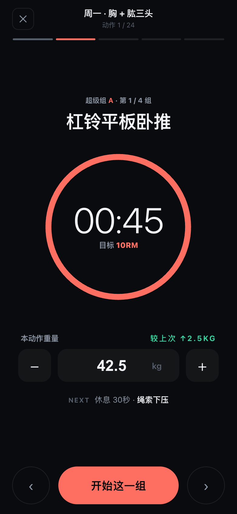
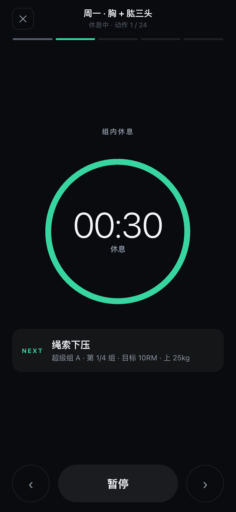
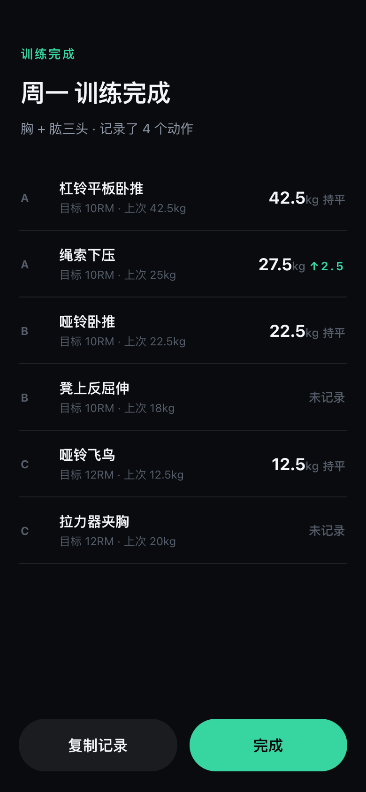
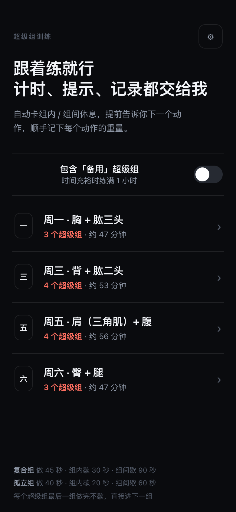
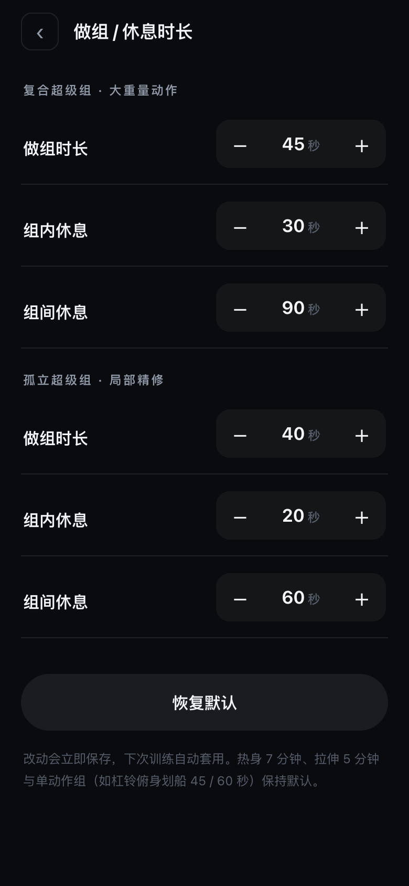

<div align="center">

# 超级组训练 · 计时台

**手机上的超级组（Superset）健身计时器** —— 自动卡组内 / 组间休息、提前提示下一个动作、记录每个动作的重量和进步。

一个零依赖、可离线、加到手机桌面就能用的**单文件 Web App**。

[](https://superset-gym.vercel.app)


<br>





</div>

---

## 这是什么

写给**时间紧、又想把训练效率拉满**的人。

核心思路一句话：用「超级组」把肌肉的休息间隙利用起来，把一次训练压缩进 **1 小时以内**。两个不冲突的动作配成一对（比如「卧推 + 三头下压」），A 练完不傻等、直接练 B，B 工作时 A 正好恢复，时间利用率翻倍。

但新手照着计划练时很繁琐：一只手要**掐表计时**，还要**记得下一个练什么**，还要**记下这个动作用了多少重量**。这个 App 就是把这三件麻烦事全包了 —— 跟着练就行。

> 训练方法参考自知乎专栏 [《健身房一周高效训练（超级组）》](https://zhuanlan.zhihu.com/p/77858795)，在其基础上做了超级组配对与时间结构的重新设计，完整计划见 [`plan.md`](plan.md)。

## ✨ 功能特性

- **⏱ 自动计时** —— 做完一组，休息倒计时自动开始，组内 / 组间该歇多久按计划卡死；最后 3 秒滴答提示，到点震动 + 蜂鸣，自动跳到下一步。
- **👀 下一个动作** —— 每个休息 / 动作界面都显眼地告诉你「接下来练什么、第几组、目标多少」，休息时还提示下一个动作上次用了多少 kg，方便提前配重。
- **🏋️ 重量 & 进步记录** —— 每个动作都能编辑重量（−/+ 2.5kg 或直接输入），让你知道「10RM 对我 = 多少 kg」；自动沿用上次重量做默认值，并实时显示 `较上次 ↑2.5kg` / `持平` / `首次记录`，结算页逐个动作列出**上次 → 本次**的进步。
- **⚙️ 时长可调** —— 复合组 / 孤立组的做组时长、组内休息、组间休息都能在设置里调，改完立即保存、下次自动套用。
- **📱 装到桌面、离线可用** —— 标准 PWA：加到手机主屏幕后**全屏运行**，首次联网打开后缓存到本地，之后断网（健身房、地铁、飞行模式）照常使用。
- **📋 一键复制记录** —— 练完把本次重量（含进步）复制成文本，存进备忘录或发给教练。
- **🔒 纯本地** —— 没有账号、没有后端、不上传任何数据，记录只存在你自己的手机里。

## 📸 截图

| 选择今天练哪天 | 训练中（计时 + 重量 + 进步） | 休息倒计时 + 下一个动作 |
|:---:|:---:|:---:|
|  |  |  |

| 做组 / 休息时长可调 | 训练结算（上次 → 本次） |
|:---:|:---:|
|  |  |

## 🗓 内置训练计划（四天分化）

| 日 | 部位 | 超级组配对思路 | 时长 |
|---|---|---|---|
| **周一** | 胸 + 肱三头 | 推类动作 + 三头孤立 | 约 47 分钟 |
| **周三** | 背 + 肱二头 | 拉类动作 + 二头孤立 | 约 53 分钟 |
| **周五** | 肩（三角肌）+ 腹 | 推举 / 平举 + 核心 | 约 56 分钟 |
| **周六** | 臀 + 腿 | 下肢复合 + 下肢孤立 | 约 47 分钟 |

每天结构：**7 分钟动态热身 → 3～4 个超级组 → 5 分钟静态拉伸**。

默认时长（设置里可改）：

- **复合超级组** —— 做 45 秒 · 组内歇 30 秒 · 组间歇 90 秒
- **孤立超级组** —— 做 40 秒 · 组内歇 20 秒 · 组间歇 60 秒
- 每个超级组最后一组做完不额外休息，直接进下一组

完整动作、强度（RM）、热身拉伸细节见 [`plan.md`](plan.md)。

## 🚀 在手机上使用

1. 用 **Safari** 打开 **[superset-gym.vercel.app](https://superset-gym.vercel.app)**
2. 点底部**分享**按钮 → **添加到主屏幕**
3. 桌面出现图标，点开即全屏运行

> 第一次打开需要联网（缓存到手机），之后离线也能用。iPhone 请用 Safari 添加（Chrome on iOS 加桌面不会全屏）。

## 🛠 本地运行 / 自行部署

**本地预览**（任何带 Python 的电脑）：

```bash
git clone https://github.com/askxiaozhang/superset-gym.git
cd superset-gym
python3 -m http.server 8080
# 浏览器打开 http://localhost:8080
```

**部署**：纯静态、无构建步骤，丢到任意静态托管即可（Vercel / Cloudflare Pages / GitHub Pages / Netlify）。

> 注意：Service Worker 离线需要 **HTTPS 或 localhost** 环境；通过局域网 IP（`http://192.168.x.x`）访问时离线缓存不会生效，但功能正常。

**重新生成 App 图标**（可选，需 [Pillow](https://pypi.org/project/pillow/)）：

```bash
python3 gen_icons.py
```

## 🧩 技术说明

- **单文件** `index.html`：原生 HTML / CSS / JavaScript，**无框架、无构建、无依赖**。
- 计时：基于时间戳的倒计时（防漂移）+ Web Audio 蜂鸣 + `navigator.vibrate` 震动 + Wake Lock 防熄屏。
- 数据：`localStorage`（每个动作的重量、自定义时长）。
- 离线：`manifest.webmanifest` + `sw.js`（Service Worker 缓存应用外壳）实现可安装 PWA。
- 无后端、无网络请求、无追踪。

## 📂 目录结构

```
index.html              # 整个 App（HTML/CSS/JS 全在这一个文件）
manifest.webmanifest    # PWA 清单
sw.js                   # Service Worker（离线缓存）
apple-touch-icon.png    # iOS 桌面图标
icon-192/512*.png       # PWA 图标（含 maskable）
gen_icons.py            # 用 Pillow 生成上述图标
plan.md                 # 训练计划原文（动作 / RM / 热身拉伸）
screenshots/            # README 截图
```

## 🙏 致谢
- 针对我个人的训练计划来自知乎专栏 [https://zhuanlan.zhihu.com/p/2046995401551749753](https://zhuanlan.zhihu.com/p/2046995401551749753) , 计划详细与修改参考自下述链接
- 训练方法参考自知乎专栏 [zhuanlan.zhihu.com/p/77858795](https://zhuanlan.zhihu.com/p/77858795)。
- 训练计划仅供参考，如有伤病或基础疾病，请先咨询专业人士。

## 📄 许可证

[MIT](LICENSE) © 2026 askxiaozhang
